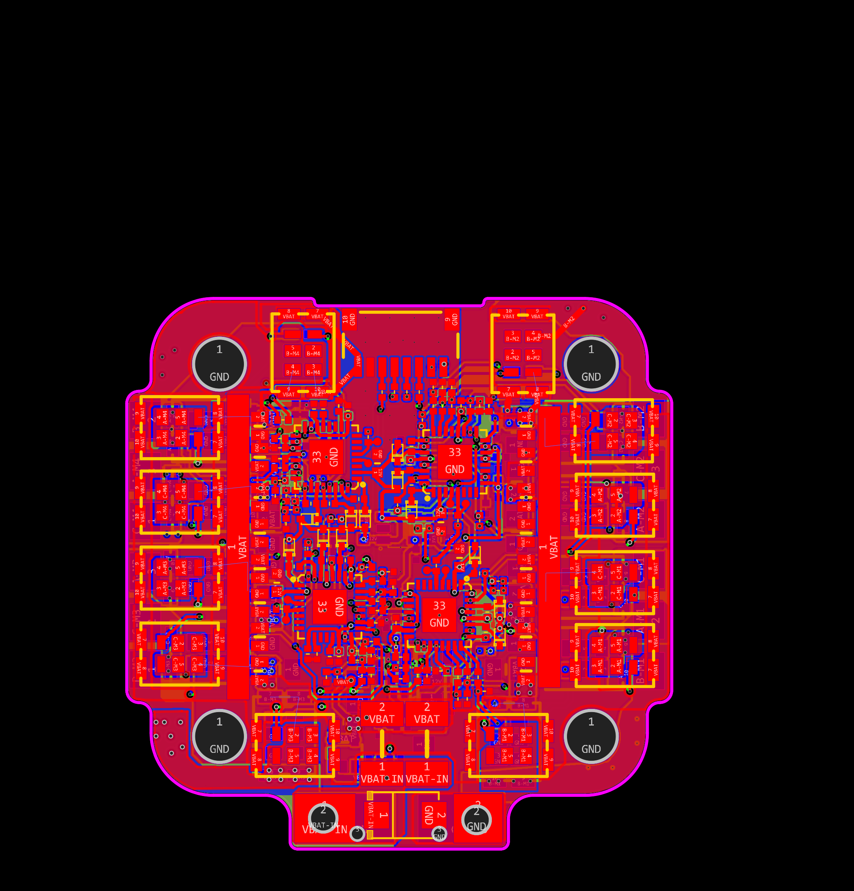

# DIY 4合1 飞控 & 75A 电调

> 自主设计的 FPV 无人机飞控与 4合1 电调一体板，从原理图到 PCB 布局全程独立完成。

---

## 硬件规格

| 参数 | 规格 |
|---|---|
| 类型 | 4合1 电调（四路电调集成于单板） |
| 持续电流 | 75A × 4 |
| 支持协议 | DSHOT600 / DSHOT300 / PWM / Oneshot |
| PCB 层数 | **10 层** |
| MOS 驱动 | **英飞凌（Infineon）栅极驱动 IC** |
| 适用电压 | 3S ~ 6S LiPo |

---

## 设计亮点

### 10 层 PCB

10 层板设计为大电流路径提供了充裕的铜皮截面积与多层并联导流，相比常见的 4 层板：

- 电源层与地层各有多层并联，载流能力大幅提升
- 信号层与功率层完全隔离，消除大电流切换对 PWM 信号的干扰
- 更低的 PCB 走线阻抗，减少高电流下的压降与发热

### 英飞凌栅极驱动

采用英飞凌（Infineon）专用 MOS 栅极驱动 IC，相比通用驱动方案：

- 更快的栅极充放电速度，降低 MOS 管开关损耗
- 内置死区时间控制，防止上下桥臂直通
- 更强的驱动能力，支持大尺寸低 Rds(on) MOS 管，降低导通损耗
- 工业级可靠性，适应高温、高电流工作环境

### DSHOT600 数字协议

支持 DSHOT600 数字电调协议：

- 无需油门校准，数字信号抗干扰能力强
- 双向 DSHOT 支持转速反馈（RPM Telemetry），配合 INAV/Betaflight 实现 RPM 滤波
- 相比 PWM/Oneshot，延迟更低、精度更高

---

## 仓库文件

| 文件 | 说明 |
|---|---|
| `Gerber_75A电调_2026-03-17.zip` | PCB 制造文件，可直接提交打样 |
| `SCH_Schematic1_2026-03-17.pdf` | 完整原理图 |
| `PCB_75A电调_*.png` | PCB 各层预览图 |

---

## PCB 预览

---

## 相关项目

- [SkyPilot H743 飞控](https://github.com/19379353560/skypilot) — 配套飞控主板
- [INAV 优化固件](https://github.com/19379353560/inav) — 配套飞控固件
